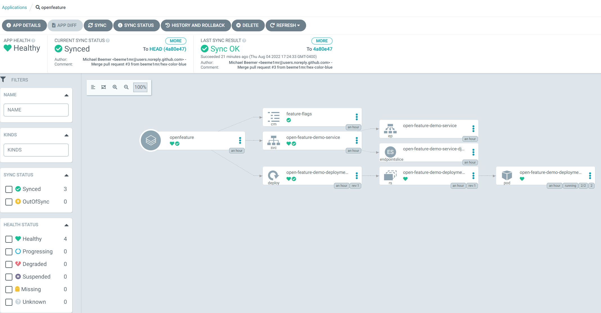

# OpenFeature Demo using ArgoCD

A repo for experimenting with OpenFeature and flagD using ArgoCD.

## Getting started

1. Configure ArgoCD by following their [getting started](https://argo-cd.readthedocs.io/en/stable/getting_started/) guide.
1. Add the OpenFeature app using the argo cli: ` argocd app create openfeature --repo https://github.com/beeme1mr/openfeature-demo-argocd.git --path openfeature-demo-app --dest-server https://kubernetes.default.svc --dest-namespace default`
1. Sync the project using the argo cli: `argocd app sync openfeature`

